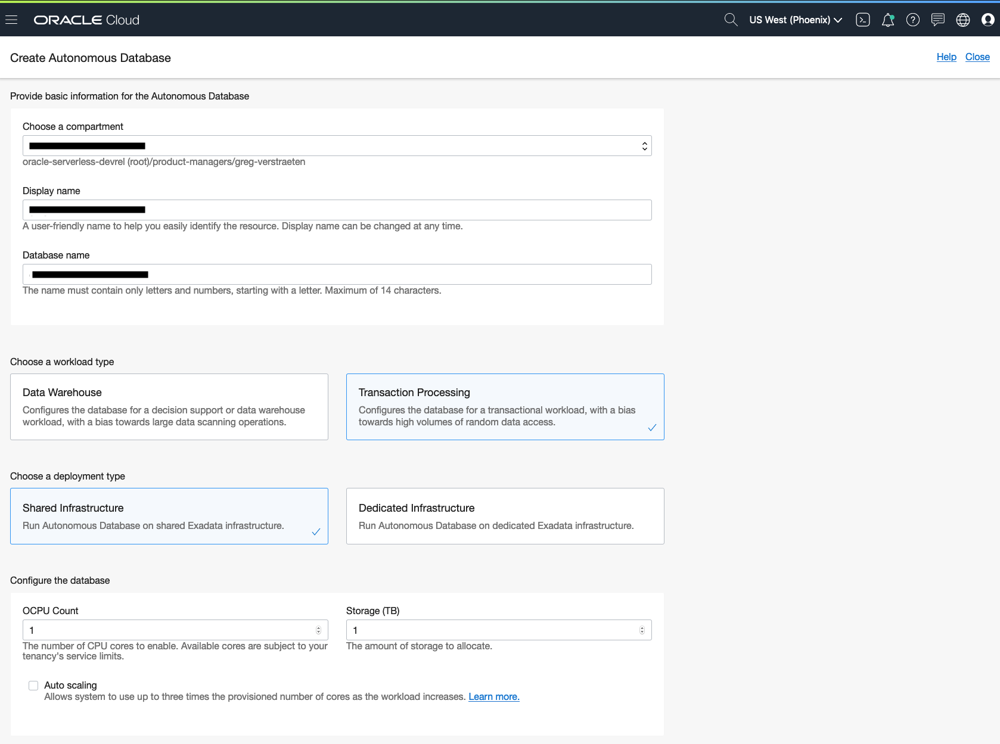

# Function that executes a SQL statement using ORDS

This function connects to an Autonomous Database using ORDS and executes a SQL statement.

As you make your way through this tutorial, look out for this icon .
Whenever you see it, it's time for you to perform an action.


## Prerequisites
Before you deploy this sample function, make sure you have run step A, B and C of the [Oracle Functions Quick Start Guide for Cloud Shell](https://www.oracle.com/webfolder/technetwork/tutorials/infographics/oci_functions_cloudshell_quickview/functions_quickview_top/functions_quickview/index.html)
* A - Set up your tenancy
* B - Create application
* C - Set up your Cloud Shell dev environment


## List Applications 
Assuming your have successfully completed the prerequisites, you should see your 
application in the list of applications.
```
fn ls apps
```


## Create or Update your Dynamic Group
In order to use other OCI Services, your function must be part of a dynamic group. For information on how to create a dynamic group, refer to the [documentation](https://docs.cloud.oracle.com/iaas/Content/Identity/Tasks/managingdynamicgroups.htm#To).

When specifying the *Matching Rules*, we suggest matching all functions in a compartment with:
```
ALL {resource.type = 'fnfunc', resource.compartment.id = 'ocid1.compartment.oc1..aaaaaxxxxx'}
```
Please check the [Accessing Other Oracle Cloud Infrastructure Resources from Running Functions](https://docs.cloud.oracle.com/en-us/iaas/Content/Functions/Tasks/functionsaccessingociresources.htm) for other *Matching Rules* options.


## Review and customize the function
Review the following files in the current folder:
* the code of the function, [func.py](./func.py)
* its dependencies, [requirements.txt](./requirements.txt)
* the function metadata, [func.yaml](./func.yaml)

In the code, we assume the schema and the database username are the same. Feel free to change this.


## Deploy the function
In Cloud Shell, run the *fn deploy* command to build the function and its dependencies as a Docker image, 
push the image to OCIR, and deploy the function to Oracle Functions in your application.


```
fn -v deploy --app <app-name>
```


## Create an Autonomous Database
Use an existing Autonomous Database (either Transaction Processing or Datawarehouse) or create a new one as follows.

On the OCI console, navigate to *Autonomous Transaction Processing* or *Autonomous Data Warehouse* and click *Create Autonomous Database*. In the Create Autonomous Database dialog, enter the following:
- Display Name
- Compartment
- Database Name
- Infrastructure Type: Shared
- Admin password
- License type


For more information, go to https://docs.cloud.oracle.com/iaas/Content/Database/Tasks/adbcreating.htm

On the Autonomous Database detail page, click *Service Console*


On the Service Console, navigate to Development and copy the ORDS Base URL, we will need it in the next section.


The *admin* schema is enabled for REST access by default, so you can test the function using the *admin* schema. For Production, it is recommended to create a separate schema and enable REST Service. For more information on how to do this, check the documentation at https://docs.oracle.com/en/database/oracle/oracle-rest-data-services/19.1/index.html.


## Set the function configuration values
The function requires the config value *ords-base-url*, *db-schema* and *db-pwd-cypher* to be set.


Use the *fn CLI* to set the config value:
```
fn config function <app-name> <function-name> ords-base-url <ORDS-Base-URL>
fn config function <app-name> <function-name> db-schema <DB-schema>
fn config function <app-name> <function-name> db-pwd-cypher <DB-encrypted-password>
```
e.g.
```
fn config function myapp oci-adb-ords-runsql-python ords-base-url "https://xxxxxx-db123456.adb.us-region.oraclecloudapps.com/ords/"
fn config function myapp oci-adb-ords-runsql-python db-schema "admin"
fn config function myapp oci-adb-ords-runsql-python db-pwd-cypher "xxxxxxxxx"
```


## Invoke the function

```

echo '{"sql":"<sql statement>"}' | fn invoke <app-name> oci-adb-ords-runsql-python
```
e.g.:
```
echo '{"sql":"select sysdate from dual"}' | fn invoke myapp oci-adb-ords-runsql-python
```

Upon success, the function returns a JSON object similar to this:
```json
{"sql_statement": "select sysdate from dual", "results": [{"sysdate": "2020-01-17T00:24:56Z"}]}
```
Here is another example with the table EMP created in the ADMIN schema. Ref. https://docs.oracle.com/en/database/oracle/oracle-rest-data-services/19.4/qsord/get-started-with-oracle-rest-data-services.html#GUID-14BE2F08-842E-4D2F-86B9-EA245B8487F9.

```bash
echo '{"sql":"select * from emp"}' | fn invoke gregapp1 oci-adb-ords-runsql-python | jq .
```
```json
{
  "sql_statement": "select * from emp",
  "results": [
    {
      "empno": 7369,
      "ename": "SMITH",
      "job": "CLERK",
      "mgr": 7902,
      "hiredate": "1980-12-17T00:00:00Z",
      "sal": 800,
      "comm": null,
      "deptno": 20
    },
    {
      "empno": 7499,
      "ename": "ALLEN",
      "job": "SALESMAN",
      "mgr": 7698,
      "hiredate": "1981-02-20T00:00:00Z",
      "sal": 1600,
      "comm": 300,
      "deptno": 30
    },
    {
      "empno": 7521,
      "ename": "WARD",
      "job": "SALESMAN",
      "mgr": 7698,
      "hiredate": "1981-02-22T00:00:00Z",
      "sal": 1250,
      "comm": 500,
      "deptno": 30
    },
    {
      "empno": 7566,
      "ename": "JONES",
      "job": "MANAGER",
      "mgr": 7839,
      "hiredate": "1981-04-02T00:00:00Z",
      "sal": 2975,
      "comm": null,
      "deptno": 20
    },
    {
      "empno": 7654,
      "ename": "MARTIN",
      "job": "SALESMAN",
      "mgr": 7698,
      "hiredate": "1981-09-28T00:00:00Z",
      "sal": 1250,
      "comm": 1400,
      "deptno": 30
    },
    {
      "empno": 7698,
      "ename": "BLAKE",
      "job": "MANAGER",
      "mgr": 7839,
      "hiredate": "1981-05-01T00:00:00Z",
      "sal": 2850,
      "comm": null,
      "deptno": 30
    },
    {
      "empno": 7782,
      "ename": "CLARK",
      "job": "MANAGER",
      "mgr": 7839,
      "hiredate": "1981-06-09T00:00:00Z",
      "sal": 2450,
      "comm": null,
      "deptno": 10
    },
    {
      "empno": 7788,
      "ename": "SCOTT",
      "job": "ANALYST",
      "mgr": 7566,
      "hiredate": "1987-04-19T00:00:00Z",
      "sal": 3000,
      "comm": null,
      "deptno": 20
    },
    {
      "empno": 7839,
      "ename": "KING",
      "job": "PRESIDENT",
      "mgr": null,
      "hiredate": "1981-11-17T00:00:00Z",
      "sal": 5000,
      "comm": null,
      "deptno": 10
    },
    {
      "empno": 7844,
      "ename": "TURNER",
      "job": "SALESMAN",
      "mgr": 7698,
      "hiredate": "1981-09-08T00:00:00Z",
      "sal": 1500,
      "comm": 0,
      "deptno": 30
    },
    {
      "empno": 7876,
      "ename": "ADAMS",
      "job": "CLERK",
      "mgr": 7788,
      "hiredate": "1987-05-23T00:00:00Z",
      "sal": 1100,
      "comm": null,
      "deptno": 20
    },
    {
      "empno": 7900,
      "ename": "JAMES",
      "job": "CLERK",
      "mgr": 7698,
      "hiredate": "1981-12-03T00:00:00Z",
      "sal": 950,
      "comm": null,
      "deptno": 30
    },
    {
      "empno": 7902,
      "ename": "FORD",
      "job": "ANALYST",
      "mgr": 7566,
      "hiredate": "1981-12-03T00:00:00Z",
      "sal": 3000,
      "comm": null,
      "deptno": 20
    },
    {
      "empno": 7934,
      "ename": "MILLER",
      "job": "CLERK",
      "mgr": 7782,
      "hiredate": "1982-01-23T00:00:00Z",
      "sal": 1300,
      "comm": null,
      "deptno": 10
    }
  ]
}
```