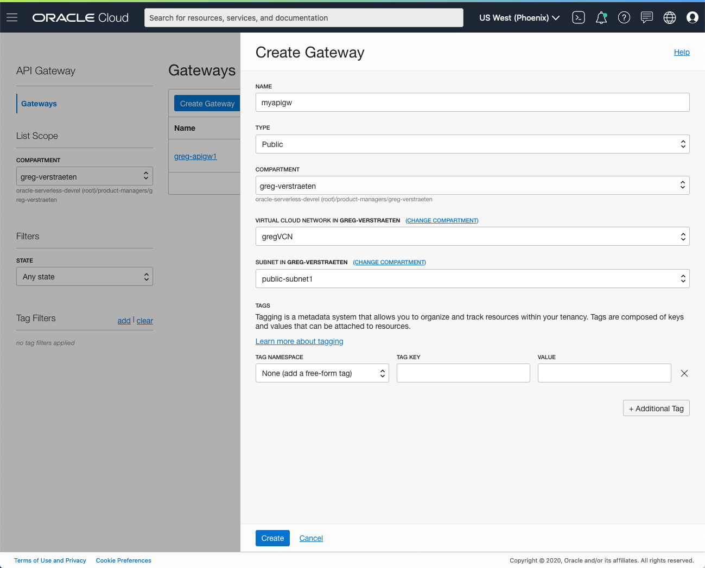
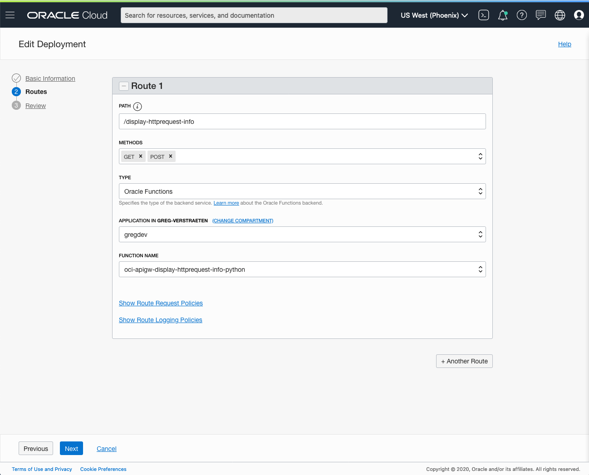

# Function that returns the HTTP request information when called through API Gateway
This function returns the HTTP request information when called through API Gateway.

As you make your way through this tutorial, look out for this icon .
Whenever you see it, it's time for you to perform an action.


## Prerequisites
Before you deploy this sample function, make sure you have run step A, B and C of the [Oracle Functions Quick Start Guide for Cloud Shell](https://www.oracle.com/webfolder/technetwork/tutorials/infographics/oci_functions_cloudshell_quickview/functions_quickview_top/functions_quickview/index.html)
* A - Set up your tenancy
* B - Create application
* C - Set up your Cloud Shell dev environment


## List Applications 
Assuming your have successfully completed the prerequisites, you should see your 
application in the list of applications.
```
fn ls apps
```


## Review and customize the function
Review the following files in the current folder:
* the code of the function, [func.py](./func.py)
* its dependencies, [requirements.txt](./requirements.txt)
* the function metadata, [func.yaml](./func.yaml)


## Deploy the function
In Cloud Shell, run the *fn deploy* command to build the function and its dependencies as a Docker image, 
push the image to OCIR, and deploy the function to Oracle Functions in your application.


```
fn -v deploy --app <app-name>
```


## Create the API Gateway
The functions is meant to be invoked through API Gateway.


On the OCI console, navigate to *Developer Services* > *API Gateway*. Click on *Create Gateway*. Provide a name, set the type to "Public", select a compartment, a VCN, a public subnet, and click *Create*. 



Once created, click on your gateway. Under *Resources*, select *Deployments* and click *Create Deployment*. Provide a name, a path prefix ("/v1" for example), click *Next*. Provide a name to the route ("/display-httprequest-info" for example), select methods "GET" and "POST", select type "Oracle Functions", select the Application for your function, and select your function you deployed in the previous step.



Click *Next* and finally, click *Save Changes*.

Note the endpoint of your API Gateway deployment.


## Create or Update your Dynamic Group for API Gateway
In order to invoke functions, your API Gateway must be part of a dynamic group.

When specifying the *Matching Rules*, we suggest matching all functions in a compartment with:
```
ALL {resource.type = 'ApiGateway', resource.compartment.id = 'ocid1.compartment.oc1..aaaaaxxxxx'}
```


## Create or Update IAM Policies for API Gateway
Create a new policy that allows the API Gateway dynamic group to invoke functions. We will grant `use` access to `functions-family` in the compartment.


Your policy should look something like this:
```
Allow dynamic-group <dynamic-group-name> to use functions-family in compartment <compartment-name>
```

For more information on how to create policies, check the [documentation](https://docs.cloud.oracle.com/iaas/Content/Identity/Concepts/policysyntax.htm).


## Set the function configuration values
The function returns the configuration values you set.


Use the *fn CLI* to set the config value:
```
fn config function <app-name> <function-name> <configkey> <configvalue>
```
e.g.
```
fn config function myapp oci-apigw-display-httprequest-info-python configkey1 "value1"
```


## Invoke the function
The function returns the information of the HTTP request through API Gateway.


Set the Environment variable "APIGW_ENDPOINT" to the value of the endpoint of your API Gateway deployment, e.g.
```
export APIGW_ENDPOINT=https://xxxxx.apigateway.us-phoenix-1.oci.customer-oci.com/v1
```

Use the curl command to make the HTTP request. You can optionally specify a request header just to see it returned by the function. You may want to pipe the curl command to `jq` to get a nicer output.
```
curl --header "X-MyHeader1: headerValue" $APIGW_ENDPOINT/display-httprequest-info | jq .
```

Upon success, curl should return something similar to:
```
{
  "Headers": {
    "host": [
      "localhost",
      "xxxxx.apigateway.us-phoenix-1.oci.customer-oci.com"
    ],
    "user-agent": [
      "lua-resty-http/0.14 (Lua) ngx_lua/10015",
      "curl/7.64.1"
    ],
    "transfer-encoding": "chunked",
    "content-type": [
      "application/octet-stream",
      "application/octet-stream"
    ],
    "date": "Tue, 23 Jun 2020 01:09:41 GMT",
    "fn-call-id": "xxxxxxxxx",
    "fn-deadline": "2020-06-23T01:10:21Z",
    "accept": "*/*",
    "forwarded": "for=x.x.x.x",
    "x-forwarded-for": "x.x.x.x",
    "x-myheader1": "headerValue",
    "x-real-ip": "x.x.x.x",
    "fn-http-method": "GET",
    "fn-http-request-url": "/v1/display-httprequest-info",
    "fn-intent": "httprequest",
    "fn-invoke-type": "sync",
    "oci-subject-id": "ocid1.apigateway.oc1.phx.xxxxx",
    "oci-subject-tenancy-id": "ocid1.tenancy.oc1..xxxxx",
    "oci-subject-type": "resource",
    "opc-request-id": "xxxxxxxxx",
    "x-content-sha256": "xxxxxxxxx",
    "accept-encoding": "gzip"
  },
  "Configuration": {
    "PATH": "/usr/local/bin:/usr/local/sbin:/usr/local/bin:/usr/sbin:/usr/bin:/sbin:/bin",
    "HOSTNAME": "xxxxxxxxx",
    "FN_FN_ID": "ocid1.fnfunc.oc1.phx.xxxxx",
    "FN_MEMORY": "256",
    "FN_TYPE": "sync",
    "configkey1": "value1",
    "FN_LISTENER": "unix:/tmp/iofs/lsnr.sock",
    "FN_FORMAT": "http-stream",
    "FN_APP_ID": "ocid1.fnapp.oc1.phx.xxxxx",
    "FN_CPUS": "100m",
    "OCI_RESOURCE_PRINCIPAL_RPST": "/.oci-credentials/rpst",
    "OCI_RESOURCE_PRINCIPAL_PRIVATE_PEM": "/.oci-credentials/private.pem",
    "OCI_RESOURCE_PRINCIPAL_VERSION": "2.2",
    "OCI_RESOURCE_PRINCIPAL_REGION": "us-phoenix-1",
    "OCI_REGION_METADATA": "{\"realmDomainComponent\":\"oraclecloud.com\",\"realmKey\":\"ocX\",\"regionIdentifier\":\"xx-xxxxx-x\",\"regionKey\":\"XXX\"}",
    "LANG": "C.UTF-8",
    "GPG_KEY": "xxxxxxxxx",
    "PYTHON_VERSION": "3.6.10",
    "PYTHON_PIP_VERSION": "20.1.1",
    "PYTHON_GET_PIP_URL": "https://github.com/pypa/get-pip/raw/eff16c878c7fd6b688b9b4c4267695cf1a0bf01b/get-pip.py",
    "PYTHON_GET_PIP_SHA256": "xxxxxxxxx",
    "PYTHONPATH": "/function:/python",
    "HOME": "/home/fn"
  },
  "Request body": {},
  "Request URL": "/v1/display-httprequest-info",
  "Query String": {},
  "Request Method": "GET",
  "AppID": "ocid1.fnapp.oc1.phx.xxxxx",
  "FnID": "ocid1.fnfunc.oc1.phx.xxxxx",
  "CallID": "xxxxxxxxx",
  "Format": "http-stream",
  "Deadline": "2020-06-23T01:10:21Z"
}
```

Now, use the "POST" method so you can specify a request payload, and specify some query string parameters:
```
curl -X POST --header "X-MyHeader1: headerValue" -d '{"key1":"value"}' "$APIGW_ENDPOINT/display-httprequest-info?key1=value1&key2=value2" | jq .
```

Upon success, curl should return something similar to:
```
{
  "Headers": {
    "host": [
      "localhost",
      "xxxxx.apigateway.us-phoenix-1.oci.customer-oci.com"
    ],
    "user-agent": [
      "lua-resty-http/0.14 (Lua) ngx_lua/10015",
      "curl/7.64.1"
    ],
    "transfer-encoding": "chunked",
    "content-type": [
      "application/x-www-form-urlencoded",
      "application/x-www-form-urlencoded"
    ],
    "date": "Tue, 23 Jun 2020 17:58:40 GMT",
    "fn-call-id": "xxxxxxxxx",
    "fn-deadline": "2020-06-23T17:59:10Z",
    "accept": "*/*",
    "content-length": "16",
    "forwarded": "for=x.x.x.x",
    "x-forwarded-for": "x.x.x.x",
    "x-myheader1": "headerValue",
    "x-real-ip": "x.x.x.x",
    "fn-http-method": "POST",
    "fn-http-request-url": "/v1/display-httprequest-info?key1=value1&key2=value2",
    "fn-intent": "httprequest",
    "fn-invoke-type": "sync",
    "oci-subject-id": "ocid1.apigateway.oc1.phx.xxxxx",
    "oci-subject-tenancy-id": "ocid1.tenancy.oc1..xxxxx",
    "oci-subject-type": "resource",
    "opc-request-id": "xxxxxxxxx",
    "x-content-sha256": "xxxxxxxxx",
    "accept-encoding": "gzip"
  },
  "Configuration": {
    "PATH": "/usr/local/bin:/usr/local/sbin:/usr/local/bin:/usr/sbin:/usr/bin:/sbin:/bin",
    "HOSTNAME": "xxxxxxxxx",
    "FN_LISTENER": "unix:/tmp/iofs/lsnr.sock",
    "FN_FORMAT": "http-stream",
    "FN_APP_ID": "ocid1.fnapp.oc1.phx.xxxxx",
    "FN_CPUS": "100m",
    "FN_FN_ID": "ocid1.fnfunc.oc1.phx.xxxxx",
    "FN_MEMORY": "256",
    "FN_TYPE": "sync",
    "configkey1": "value1",
    "OCI_RESOURCE_PRINCIPAL_RPST": "/.oci-credentials/rpst",
    "OCI_RESOURCE_PRINCIPAL_PRIVATE_PEM": "/.oci-credentials/private.pem",
    "OCI_RESOURCE_PRINCIPAL_VERSION": "2.2",
    "OCI_RESOURCE_PRINCIPAL_REGION": "us-phoenix-1",
    "OCI_REGION_METADATA": "{\"realmDomainComponent\":\"oraclecloud.com\",\"realmKey\":\"ocX\",\"regionIdentifier\":\"xx-xxxxx-x\",\"regionKey\":\"XXX\"}",
    "LANG": "C.UTF-8",
    "GPG_KEY": "xxxxxxxxx",
    "PYTHON_VERSION": "3.6.10",
    "PYTHON_PIP_VERSION": "20.1.1",
    "PYTHON_GET_PIP_URL": "https://github.com/pypa/get-pip/raw/eff16c878c7fd6b688b9b4c4267695cf1a0bf01b/get-pip.py",
    "PYTHON_GET_PIP_SHA256": "xxxxxxxxx",
    "PYTHONPATH": "/function:/python",
    "HOME": "/home/fn"
  },
  "Request body": {
    "key1": "value"
  },
  "Request URL": "/v1/display-httprequest-info?key1=value1&key2=value2",
  "Query String": {
    "key1": [
      "value1"
    ],
    "key2": [
      "value2"
    ]
  },
  "Request Method": "POST",
  "AppID": "ocid1.fnapp.oc1.phx.xxxxx",
  "FnID": "ocid1.fnfunc.oc1.phx.xxxxx",
  "CallID": "xxxxxxxxx",
  "Format": "http-stream",
  "Deadline": "2020-06-23T17:59:10Z"
}
```